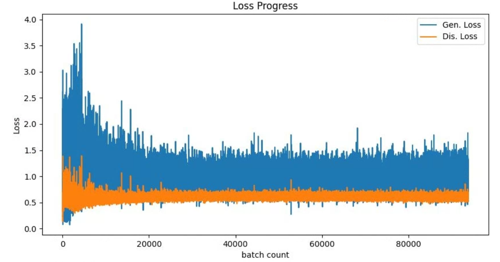

# Vanilla-GAN
"Generative Adversarial Nets" paper's code

## Paper
https://arxiv.org/pdf/1406.2661.pdf

<br/>

## Application technology
```
Python  
GAN(Generative Adversarial Nets)
Pytorch  
```

<br/>

## Result

 
Generator and Discriminator loss

<br/>
<br/>

 
Generated image
